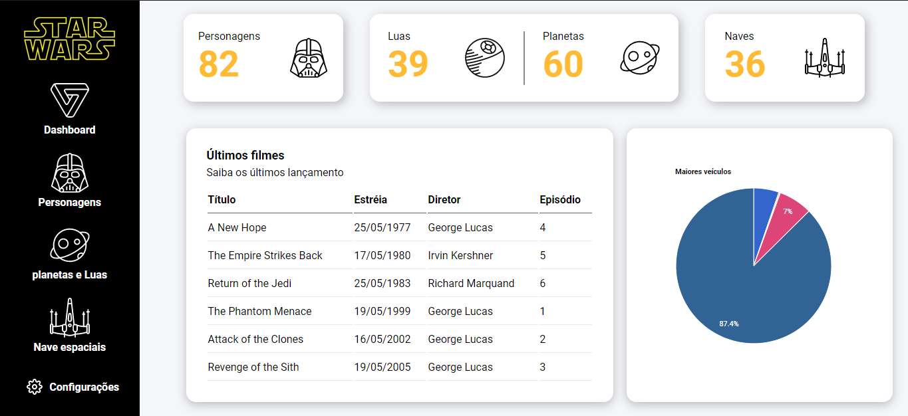

<div align="center" id="top"> 
  

  &#xa0;

  <!-- <a href="https://dashboardstarwars.netlify.app">Demo</a> -->
</div>

<h1 align="center">Dashboard Star Wars</h1>

<p align="center">
  

  

  

  

  <!--  -->

  <!--  -->

  <!--  -->
</p>

<!-- Status -->

<!-- <h4 align="center"> 
	🚧  Dashboard Star Wars 🚀 Under construction...  🚧
</h4> 

<hr> -->

<p align="center">
  <a href="#dart-about">About</a> &#xa0; | &#xa0; 
  <a href="#rocket-technologies">Technologies</a> &#xa0; | &#xa0;
  <a href="#checkered_flag-starting">Starting</a> &#xa0; | &#xa0;
  <a href="#memo-license">License</a> &#xa0; | &#xa0;
  <a href="https://github.com/{{YOUR_GITHUB_USERNAME}}" target="_blank">Lucas Ferreira</a>
</p>

<br>

## :dart: About ##

Projeto criado com a playlist do canal [Papo de dev](LINK_YOUTUBE_AQUI), para ver clique [aqui](https://LucasFerreiraProgramador.github.io/dashboard-star-wars/)

## :rocket: Technologies ##

The following tools were used in this project:

- HTML5
- CSS3
- JavaScript
- JQuery
- Axios
- SWAPI-Star Wars API
- Google Chart

## ✒ Figma
[Projeto no Figma](https://www.figma.com/file/MTmILmnLdsmesAGyGTRvV4/star-wars?node-id=0%3A1)

## :checkered_flag: Starting ##

```bash
# Clone this project
$ git clone https://github.com/LucasFerreiraProgramador/dashboard-star-wars

# Access
$ cd dashboard-star-wars

# open project
index.html
```

## :memo: License ##

This project is under license from MIT. For more details, see the [LICENSE](LICENSE.md) file.


Made with :heart: by <a href="https://github.com/LucasFerreiraProgramador" target="_blank">Lucas Ferreira</a>

&#xa0;

<a href="#top">Back to top</a>
